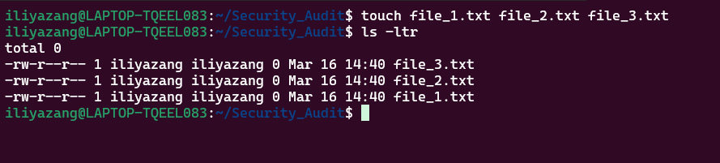

# Linux for Cybersecurity: Mastering the Command Line

Linux is a powerful tool in the cybersecurity arsenal, offering unmatched control over security systems, incident response, and threat analysis. Whether you're a beginner or an experienced professional, mastering essential Linux commands is key to protecting systems and investigating breaches.

This guide introduces key Linux commands grouped by category, with practical examples to help you build hands-on skills that are essential for cybersecurity professionals and enthusiasts alike.

## Categories Covered in This Guide
- [**File and  Directory management**](#file-and-directory-management) 

- [**File Inspection and Manipulation**](#file-inspection-and-manipulation)
- [**Networking & Connectivity**](#networking-and-connectivity)
- [**Process and System Monitoring**](#process-and-system-monitoring). 

Please feel free to skip to the section that best suits your learning goal. 

---


## 1. File and Directory Management
Understanding file structure and permissions is crucial for investigating security breaches. So today we are going to learn how to work with files. 

### Key Commands
- `ls` — List files and directories
- `rm` — Remove files or directories
- `mkdir` / `rmdir` — Create or delete directories
- `cd` — Change directory
- `pwd` — Display the current directory path
- `mv` - To move files and directories from one path to another.
- `cp` - To copy files 
- `find` - to find files and directories
- `chmod/chown` - to modify and change permission and  ownership(useful for securing sensitive files.)
- `touch` - create empty files
- `tree` - see the structural directory of root folders and all its subfolders in a hierarchical view.
- `stat` - display detailed metadata about a file.

**Example: Creating and Managing Directories with `mkdir`**
Suppose you're organizing log files for a security audit. Here's how you can create a dedicated folder for investigation data:

```bash
# creating a directory for security audits
mkdir security_audit
# change to security_audit directory 
cd security_audit 
#Printing the current directory we are currently in
pwd 
 
```
Output: `/home/user/security_audit`

**Example: Removing Directories `rm`, `rmdir`**
Suppose you need to remove a file or a sub directory in the security_audit directory we would use `rm` for removing files and `rmdir` to remove directories. 

```bash 
# Removing a file 
rm security_audit_000

#Removing a directory
rmdir legacy_audit
``` 

**Example: Moving directories with  `mv`**
Suppose you need to move a log file to the security_audit directory for investigation: 
```bash 
# Moving a log file to the security_audit directory
mv /home/user/system.log /home/user/security_audit/
```
This ensures your audit data stays organized and accessible during investigations. 


**Example: copying files `cp`**
Suppose you want to create a backup of a critical configuration file:

```bash 
cp /etc/ssh/sshd_config /home/user/security_audit/sshd_config.bak
```
**Example: Finding Files with `find`**
To locate all .log files in the /var/log directory:
```bash
find /var/log -name "*.log"
```
**Example: Changing File Permissions with `chmod`**
In Linux, file permissions are managed using numeric values:

4 = Read

2 = Write

1 = Execute

For example, to grant the owner read and write permissions (4 + 2 = 6) and no permissions for others:
```bash 
chmod 600 /home/user/security_audit/sshd_config.bak
```


**Alternatively, you can modify permissions using symbolic notation:**

u+x — Add execute permission for the user

g+x — Add execute permission for the group

o+x — Add execute permission for others

**Example of adding execute permission for the user:**
```bash 
chmod u+x script.sh
```
**Example: Changing Ownership with `chown`**
To assign ownership of a file to the root user:
```bash
chown root:root /home/user/security_audit/sshd_config.bak
```
For change file ownership (`chown`), in the example above we have `root:root`. The root before the colon signifies the owner and the root after the colon signifies the group. 
But what if I wanted to change one or the other? Pretty simple! 
For the owner?: 
```bash 
#specifying only the owner and not the group. 
# This would change the owner of the file and leave the group as its current default value. 
chown root: file_1.bat
```
For the Group? you guessed it! Just do the opposite. 

```bash 
#leave the owner as default but change the value of group to root for file_1.bat
chown :root file_1.bat
``` 

**Example: Creating empty files with `touch`**
You can use the `touch` command to create an empty file.
You can even create multiple files at a time using touch. `touch` is useful when you want to create a file without modifying it right away. Lets create multiple files using the `touch` command. 

```bash 
touch file_1.txt file_2.txt file_3.txt
``` 
Output:




By understanding these foundational commands, you'll streamline your investigations and improve file organization -- critical skills for cybersecurity analysis.  
 
## 2. File Inspection and Manipulation 
**Key Commands** 
-`cat` - Display file contents. 
-`less/more`- View large files in a scrollable format.
-`head/tail` - Display the first of last lines of a file.
-`grep` - Search for patterns in files. 

**Example: Using `cat` to display file contents

```bash
cat /var/log/syslog
```
**Example: Using `less` for reviewing system logs.**

```bash
less /var/log/syslog
```
- We can examine system activity without opening the entire file.

**Example: Using Grep for Log analysis**
```bash
grep 'Failed Password' Var/log/auth.log
```
- We can search logs for brute-force attack patterns.

## Networking and Connectivity 


## Process and System Monitoring 


## 3. Networking and Connectivity

**Key Commands**

ifconfig — Display network interface details.

ping — Test network connectivity.

netstat — Display active network connections.

curl — Transfer data from URLs.

wget — Download files from the web.

**Example: Checking Network Interface Details with `ifconfig`**

```bash 
ifconfig eth0
```
**Example: Testing Connectivity with `ping`
```bash
ping 8.8.8.8
```

**Example: Using `curl` to test web connectivity**
```bash
curl http://example.com
```

**Example: Downloading a file with `wget`**
```bash 
wget http://example.com/samplefile.txt
```


### 4. Process and System Monitoring 

**Key Commands**
`ps` - Display current running processes.
`top/htop` - Real-time system monitoring. 
`kill` - Terminate processes. 
`uptime` - Show system uptime.
`df/du` - Display disk space usage.

**Example: Viewing Running Processes with `ps`**
```bash
ps aux | grep apache2
```
**Example: Monitoring System Performance with `top`
``` bash
top
```

**Example: Terminating a process wwith `kill`
```bash 
kill -9 <PID>
```
Try these few commands in your spare time. Mastering these essential Linux Commands is crucial for cybersecurity professionals, especially when
investigating breaches, analyzing threats, or responsing to incidents. By applying these commands in real-world scenarios, you'll develop the skills to manage files, inspect data, troubleshoot network issues, and monitor system processes effectively. Continuous practice will enchance your confidence in navigating Linux envrionments securely and efficiently.

---
### Wargames 
Lets improve our skills through practice. This set of wargames is offered by OverTheWire. 

See how many levels you can beat!. 


Happy Learninng!

